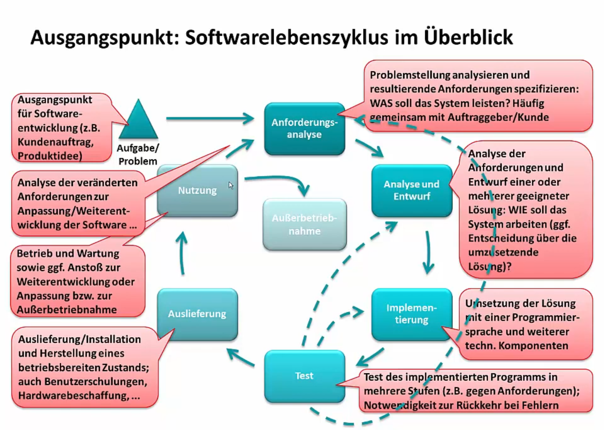

# Software-Lebenszyklus
## 1 Anforderungsanalyse
In der ersten Phase des Lebenszyklus wird eine ausführliche Analyse durchgeführt. Hierfür ist eine genaue Problembeschreibung des Kunden nötig. Die genaue Problembeschreibung bildet das Fundament für die nächsten Schritte. Man erstellt auf Basis der Problembeschreibung einen Plan wie die neue Software das bestehende Problem lösen soll und definiert die genauen Spezifikationen. Ist dies abgeschlossen, wird alles im Pflichtenheft zusammengefasst.

(entspricht Phase 1)

## 2 Analyse und Entwurf
In der zweiten Phase wird ein erster Entwurf der Software erstellt. Hierbei gibt es zwei Stufen, der Grobentwurf und der Feinentwurf. Beim Grobentwurf wird zuerst über die fundamentalen Komponenten entschieden. Hierbei spielt die gewählte Architektur eine Rolle, sowie die benötigten Komponenten und Abhängigkeiten im System. Im Feinkonzept wird das Grobkonzept detaillierter umgesetzt. Hierzu werden genaue Angaben gemacht, mit denen die Entwickler die Software am Ende umsetzen können.

(entspricht Phase 2-8)

## 3 Implementierung
In der dritten Phase erfolgt die Umsetzung des Programms. Hierzu wird eine Programmiersprache festgelegt und abhängig von der gewählten Herangehensweise wird dies in mehreren Phasen absolviert, wie es zum Beispiel bei SCRUM mit mehreren Sprints der Fall ist.

(entspricht Phase 9)

## 4 Test
In der vierten Phase werden die einzelnen Softwarekomponenten zusammengesetzt. Danach folgt der ausführliche Test der Software. Dabei wird überprüft ob die Software richtig funktioniert. Es wird jede Funktion des Programms überprüft und mögliche Fehler behoben. So wird sichergestellt, dass ein vollständiges und funktionsfähiges Programm an den Kunden ausgeliefert wird. 

## 5 Auslieferung

Nach erfolgreich absolvierten Tests wird die Software ausgeliefert, installiert und in einen betriebsbereiten Zustand versetzt. Dazu muss eventuell Hardware beschafft werden. Auch Benutzerschulungen gehören zu dieser Phase. 

## 6 Nutzung

Während der produktiven Nutzung fallen Wartungsarbeiten an. Es können sich weitere Anforderungen zur Anpassung oder Weiterentwicklung der Anwendung ergeben. Damit wird der Software-Lebenszyklus ein weiteres Mal durchlaufen.

Die Vorgangsmodelle können danach eingeteilt werden, wie sie durchgeführt werden (sequenziell vs. evolutionär)
und wie sie mit dem Kunden interagieren bzw. der Starrheit der Projektplanung.

# Formalität
## Vorteile von formellen Methoden
- Keine Veränderungen durch Kundenwünsche während der Projektlaufzeit
- Resourcen- & Zeitplanung sind weit im Voraus absichtlich
- Betriebswirtschaftliche Vorteile durch Vorausplanung
- Erfordert kaum Kundeninteraktion während der Projektlaufzeit

## Vorteile von informellen Methoden
- Gut geeignet für kleine Teams
- Geringerer Planungsaufwand
- Ermöglicht dynamische Kundenwünsche
- Kompletter Projektscope muss nicht zum Anfang bekannt sein

# Sequenzialität
## Vorteile sequenzieller Methoden
- Aktueller Stand in der Projektausführung ist immer klar erkennbar
- einfachere Implementierung & Verwaltung
- kein Featurecreep

## Vorteile evolutionärer Methoden
- Höhere Qualität
- Leichte Lösung von Problemen in der Entwicklungszeit
- Testen einzelner Schritte während des Projektes zeigt Fehler schnell auf
- Zwischenstände können dem Kunden präsentiert werden
- Fehler in der Projektplanung können leicht ausgeglichen werden

*Wir entscheiden uns daher durch unser kleines Team, der nicht notwendigen Erweiterbarkeit des Teams für Scrum.*

Unsere Projektmeilensteine werden wir an den Aufgabenphasen festlegen, Storypunkte sind Teilaufgaben.